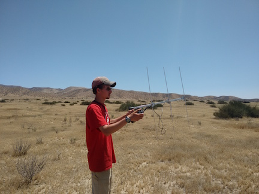

---
title:
author: "cjlortie & taylor noble"
date: "Sept 2016"
output:
  html_document:
    theme: yeti
    toc: yes
    toc_depth: 3
    toc_float: yes
  pdf_document:
    toc: yes
---
#A systematic review of telemetry as an ecological research tool in deserts.

###Purpose
To describe ecological use patterns of telemetry in desert ecosystems.




[ecoblender](http://ecoblender.org)

###Methods
A systematic review of telemetry studies in deserts. A formalized synthesis of all research using telemetry in deserts.

Keyword search on Web of Science only: telemetry and desert, or radio tracking and desert Collaborators: Taylor Noble.

```{r, setup, include=FALSE}
knitr::opts_chunk$set(cache=TRUE)
#library loads ####
library(tidyverse)
#library(lme4)
#library(lattice)
#library(latticeExtra)
library(rgdal)
library(maps)

```

###Map
```{r, data load & maps}
#simple data load
data<-read_csv("data/telemetry review.csv")
#str(data)
data

#mapping in ggplot2 lat-long must be in decimal degrees
world<-map_data("world")
map<-ggplot() + geom_polygon(data=world, colour="gray50", fill="gray50", aes(x=long, y=lat, group=group)) + 
  xlab("Longitude") +
  ylab("Latitude")
map + geom_point(data=data, aes(x=long, y=lat), color="green")

#map again in bw
map + geom_point(data=data, aes(x=long, y=lat), color="black")

#count up country frequencies
countries<-data %>% group_by(country) %>% summarise(n=n())
countries
countries <- countries %>% filter(n > 2)

qplot(country, n, geom="boxplot", data=data, xlab="Country", ylab="Frequency") +
  coord_flip()

p2<-ggplot(countries) + geom_bar(mapping = aes(country, sort(n)), stat = "identity")
#p2


c1<-chisq.test(countries$country, countries$n, simulate.p.value = TRUE, B = 10000)
c1

```

###Hypotheses
```{r, hypotheses}
#main H
#main H correctly plotted
#classic 
ggplot(data, aes(main.H)) + geom_bar(mapping = aes(fill= target.taxa), stat = "count") + 
  xlab("Hypothesis") + 
  ylab("Frequency") +
  scale_fill_discrete(name="Target taxa")

#brewer
ggplot(data, aes(main.H)) + geom_bar(mapping = aes(fill= target.taxa), stat = "count") + 
  xlab("Hypothesis") + 
  ylab("Frequency") +
  scale_fill_brewer(name="Target taxa")

#grey
ggplot(data, aes(main.H)) + geom_bar(mapping = aes(fill= target.taxa), stat = "count") + 
  xlab("Hypothesis") + 
  ylab("Frequency") +
  scale_fill_grey(name="Target taxa", start = 0, end = .9) + theme_bw()


main.hypotheses<-data %>% group_by(main.H) %>% summarise(n=n())
main.hypotheses
c2<-chisq.test(main.hypotheses$n, simulate.p.value = TRUE, B = 10000)
c2

#secondary H
ggplot(data, aes(secondary.H, na.rm = TRUE)) + geom_bar(stat = "count") + xlab("Secondary hypothesis") + ylab("Frequency")

secondary.hypotheses<-data %>% group_by(secondary.H) %>% summarise(n=n())
secondary.hypotheses
c3<-chisq.test(secondary.hypotheses$n, simulate.p.value = TRUE, B = 10000)
c3

#frequency of multiple H tested
qplot(as.factor(number.H.test), data=data, xlab="number of hypotheses tested")
#count up
number.H<-data %>% group_by(as.factor(number.H.test)) %>% summarise(n=n())
number.H
c4<-chisq.test(number.H$n, simulate.p.value = TRUE, B = 10000)
c4
```

###Taxa
```{r, taxa}
#freq of different taxa
qplot(target.taxa, data=data, xlab="taxa tested")

#count up
taxa<-data %>% group_by(target.taxa) %>% summarise(n=n())
taxa

c5<-chisq.test(taxa$n, simulate.p.value = TRUE, B = 10000)
c5

#did they test other taxa
ggplot(data) + geom_freqpoly(aes(other.taxa))
other.taxa<-data %>% group_by(other.taxa) %>% summarise(n=n())
other.taxa

```

###Replication
```{r, sampling effort}
#extent of replication of individual animals
qplot(main.H, n, geom="boxplot", data=data, xlab="Hypothesis", ylab="Number of individuals")


#GLM for differences
m1<-glm(n~main.H, family=gaussian, data=data)
anova(m1, test="Chisq")

```

###Device
```{r, device}
qplot(device, data=data, xlab="device")

#in full color
ggplot(data, aes(main.H)) + geom_bar(mapping = aes(fill= device), stat = "count") + 
  xlab("Hypothesis") + 
  ylab("Frequency") +
  scale_fill_brewer(name="Device")

#in grey
ggplot(data, aes(main.H)) + geom_bar(mapping = aes(fill= device), stat = "count") + 
  xlab("Hypothesis") + 
  ylab("Frequency") +
  scale_fill_grey(name= "Device", start = 0.5, end = .9) + theme_bw()

device<-data %>% group_by(device) %>% count(device)
device
c<-chisq.test(device$nn, simulate.p.value = TRUE, B = 10000)
c

```

###Scale
```{r, scale}
#did they test other taxa
ggplot(data) + geom_bar(aes(scale, stat="count"))
scale<-data %>% group_by(scale) %>% summarise(n=n())
scale

#layered plot
ggplot(data, aes(main.H)) + geom_bar(mapping = aes(fill= scale), stat = "count") + 
  xlab("Hypothesis") + 
  ylab("Frequency") +
  scale_fill_brewer(name="Scale")

#in grey
ggplot(data, aes(main.H)) + geom_bar(mapping = aes(fill= scale), stat = "count") + 
  xlab("Hypothesis") + 
  ylab("Frequency") +
  scale_fill_grey(name = "Scale", start = 0, end = .9) + theme_bw()
```

###Risk status
```{r, risk status}
ggplot(data) + geom_bar(aes(risk.status, stat="count"))
risk.status<-data %>% group_by(risk.status) %>% summarise(n=n())
risk.status

#layered plot
ggplot(data, aes(main.H)) + geom_bar(mapping = aes(fill= risk.status), stat = "count") + 
  xlab("Hypothesis") + 
  ylab("Frequency") +
  scale_fill_brewer(name="Risk status")

#in grey
ggplot(data, aes(main.H)) + geom_bar(mapping = aes(fill= risk.status), stat = "count") + 
  xlab("Hypothesis") + 
  ylab("Frequency") +
  scale_fill_grey(name = "Risk status", start = 0, end = .9) + theme_bw()

```

###Duration
```{r, duration}
#ggplot(data) +geom_histogram(aes(duration.in.days))
ggplot(data) +geom_boxplot(aes(main.H, `duration in days`)) + 
  xlab("Hypothesis") +
  ylab("Duration (in days)")

duration<-data %>% group_by(`duration in days`) %>% summarise(n=n())
duration

c6<-chisq.test(duration$n, simulate.p.value = TRUE, B = 10000)
c6
```
